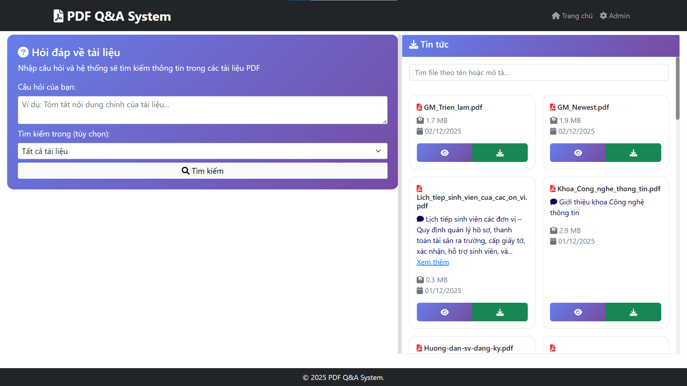
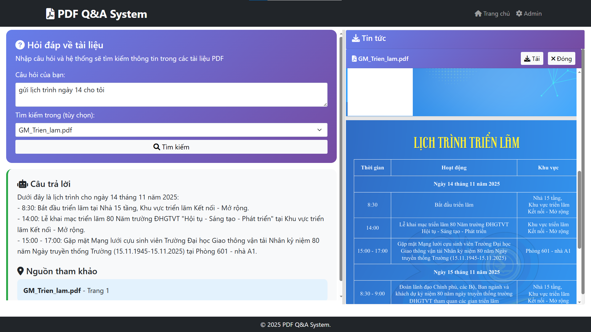
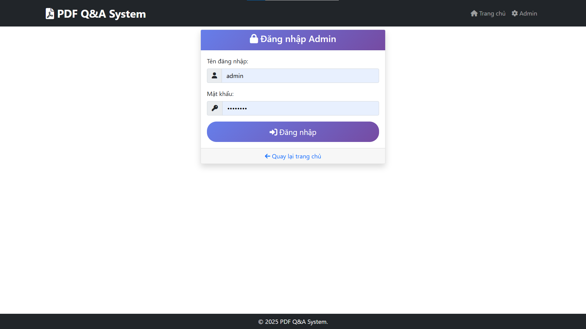
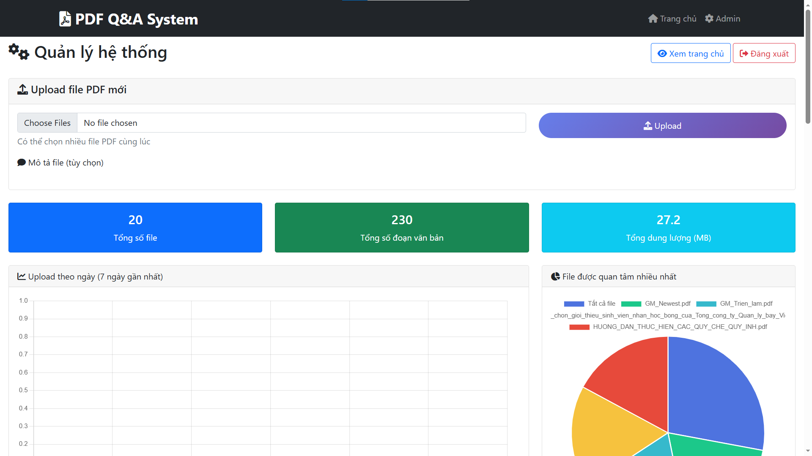
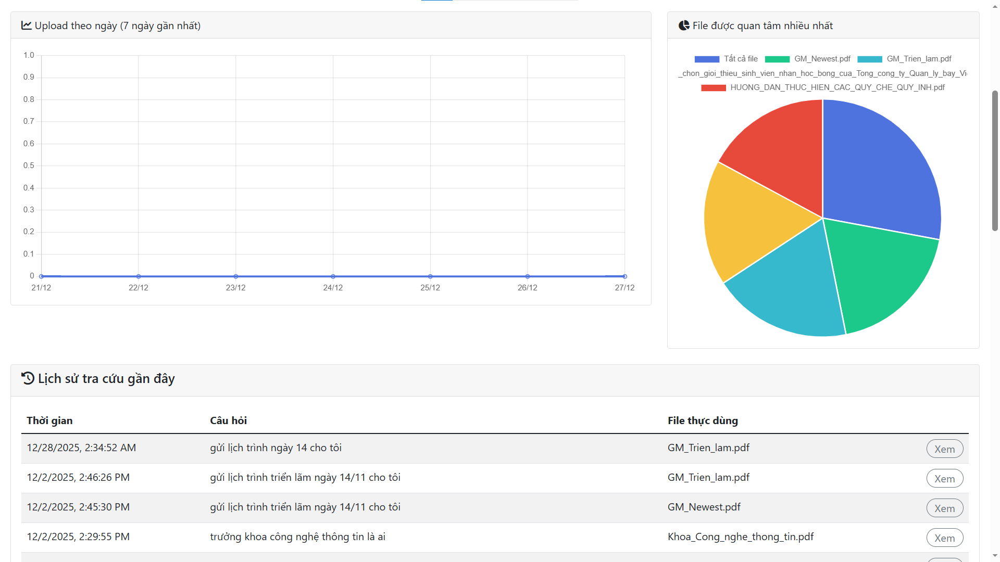
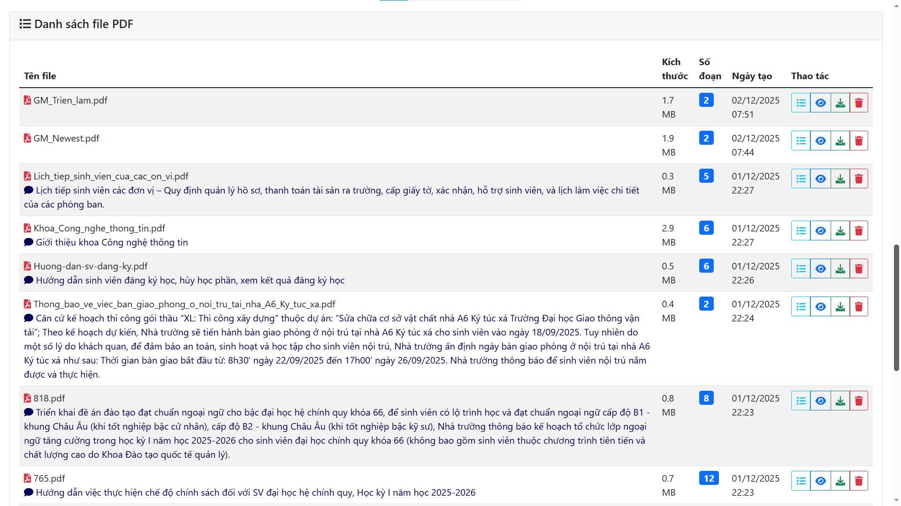
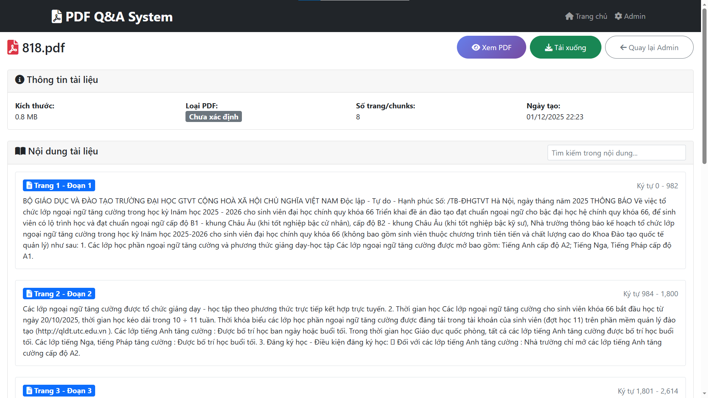

# PDF Q&A System (Flask)

Hệ thống hỏi đáp theo nội dung PDF: upload/tổ chức tài liệu, xem nội dung theo từng chunk và đặt câu hỏi để hệ thống truy xuất các đoạn liên quan rồi sinh câu trả lời.

---
## Ảnh minh hoạ 

### 1) Overview (banner)



### 2) Demo Q&A + Sources



### 3) Admin Dashboard









### 4) PDF Viewer (chunks)




---

## Tính năng chính
- Upload & quản lý PDF (giao diện người dùng + trang admin).
- Xem PDF + metadata/chunks.
- Hỏi đáp theo 1 file hoặc toàn bộ file.
- Lưu lịch sử hỏi đáp (MongoDB).
- Hỗ trợ PDF dạng **text** và (tuỳ chọn) PDF **scanned** qua Vintern API (chạy trên Colab GPU).

## Công nghệ
- Backend: Flask
- Database: MongoDB (PyMongo)
- AI:
  - Google Gemini (google-generativeai)
  - Fallback Groq (tuỳ chọn)
  - Vintern embedding (tuỳ chọn, chạy Colab)
- Xử lý PDF: PyPDF2, PyMuPDF (fitz)

## Cấu trúc thư mục (chi tiết)

> Gợi ý: đọc theo luồng `app.py` → `pdf_service.py` → `pdf_processor.py`/`gemini_service.py` → `database.py`.

### Cây thư mục (tổng quan)

```text
pdf-qa-system/
  app.py
  config.py
  database.py
  gemini_service.py
  pdf_processor.py
  pdf_service.py
  vintern_client.py
  colab.py
  requirements.txt
  .env.example
  templates/
    base.html
    index.html
    pdf_viewer.html
    admin_login.html
    admin_dashboard.html
  uploads/            (KHÔNG commit)
```

### Giải thích từng file/thư mục

- `app.py`
  - Flask app entrypoint + toàn bộ routes.
  - UI routes: `/`, `/ask`, `/pdf/<filename>`, download/view file...
  - Admin routes: `/admin`, `/admin/dashboard`, upload/delete/stats...
  - Có dùng `session` cho đăng nhập admin nên cần `SECRET_KEY`.

- `config.py`
  - Tập trung cấu hình bằng biến môi trường (đọc từ `.env`).
  - Các biến chính: `SECRET_KEY`, `MONGODB_URI`, `ADMIN_USERNAME/ADMIN_PASSWORD`, `GEMINI_API_KEYS`, `VINTERN_API_URL`...

- `database.py`
  - Wrapper MongoDB (PyMongo) + helper cho binary data (ảnh/embedding bytes).
  - Collections chính hay dùng: `pdf_files`, `pdf_chunks`, `search_history`, `system_logs`.

- `pdf_service.py`
  - Service “đầu não” của nghiệp vụ:
    - upload PDF (detect text/scanned/mixed)
    - lưu metadata/chunks vào MongoDB
    - search chunks liên quan theo câu hỏi
    - gọi `GeminiService` để sinh câu trả lời + trả về sources

- `pdf_processor.py`
  - Xử lý PDF mức thấp:
    - trích xuất text (PyPDF2)
    - phân tích trang text/scanned/mixed
    - chunking + (tuỳ cấu hình) tạo embedding cho chunk text
    - convert PDF → images (PyMuPDF + Pillow) khi cần xử lý scanned

- `gemini_service.py`
  - Tầng AI:
    - cấu hình Gemini với nhiều key để fallback
    - (tuỳ chọn) fallback sang Groq nếu cấu hình `GROQ_API_KEY`
    - sinh câu trả lời dựa trên context chunks + trả về sources
    - với scanned PDF: có thể dùng Gemini Vision (nếu có image chunks)

- `vintern_client.py`
  - Client gọi Vintern API (server bạn chạy trên Colab GPU qua ngrok).
  - Encode ảnh → embedding, convert embedding ↔ bytes để lưu DB.

- `colab.py`
  - Script hỗ trợ chạy Vintern server trên Colab, expose qua ngrok.
  - Mục tiêu: xử lý tốt PDF scanned/ảnh (phụ thuộc GPU).

- `requirements.txt`
  - Danh sách dependencies để chạy local.

- `.env.example`
  - File mẫu biến môi trường (không chứa secrets thật).

- `templates/`
  - Giao diện Jinja2:
    - `base.html`: layout chung
    - `index.html`: trang người dùng (upload/chọn file/hỏi đáp)
    - `pdf_viewer.html`: xem PDF theo chunks
    - `admin_login.html`: đăng nhập admin
    - `admin_dashboard.html`: quản trị (danh sách file/upload/xoá/stats)

- `uploads/`
  - Nơi lưu PDF upload lên khi chạy local.
  - Thư mục này đã được ignore để tránh commit dữ liệu/tài liệu thật.

## Cấu hình (biến môi trường)
Tạo file `.env` (KHÔNG commit) dựa trên `.env.example`.

Các biến quan trọng:
- `SECRET_KEY`: secret cho Flask session.
- `ADMIN_USERNAME`, `ADMIN_PASSWORD`: đăng nhập trang `/admin`.
- `MONGODB_URI`: URI MongoDB.
- `GEMINI_API_KEYS` (khuyến nghị) **hoặc** `GEMINI_API_KEY_PRIMARY`/`GEMINI_API_KEY_SECONDARY`.
- `GROQ_API_KEY`: (optional) fallback.
- `VINTERN_API_URL`: (optional) URL Vintern API (ngrok) để xử lý scanned PDF.

## Chạy local (Windows)
> Yêu cầu: Python 3.10+ (khuyến nghị), MongoDB (local hoặc Atlas).

```powershell
cd "E:\Chuyên đề Công nghệ thông tin\pdf-qa-system"
python -m venv .venv
.\.venv\Scripts\Activate.ps1
pip install -r requirements.txt

# Tạo .env từ .env.example và điền giá trị thật
python app.py
```

Mặc định Flask chạy tại: `http://127.0.0.1:5000`
- Trang người dùng: `/`
- Admin login: `/admin`

## Chạy Vintern API trên Colab GPU (tuỳ chọn, cho scanned PDF)
1. Mở notebook Colab của bạn.
2. Thay `NGROK_AUTH_TOKEN` bằng key đã đăng ký trên Ngrok.
3. Chạy để lấy `Public URL`.
4. Ở máy local, set `VINTERN_API_URL=<public_url>` trong `.env` rồi restart app.


## Hướng dẫn sử dụng (ngắn)

### Bước 1 — Upload PDF
- Vào trang chủ, chọn đăng nhập admin để thực hiện upload PDF.
- Sau khi upload xong, file sẽ xuất hiện ở đầu danh sách tài liệu (cả admin và trang chủ người dùng).

### Bước 2 — Đặt câu hỏi
- Chọn 1 file cụ thể hoặc để trống để hỏi trên **tất cả file**.
- Nhập câu hỏi, ví dụ:
  - “Tóm tắt các ý chính trong tài liệu.”
  - “Điều kiện xét học bổng là gì?”
  - ...

### Bước 3 — Xem sources và đối chiếu
- Xem phần **sources** để biết câu trả lời dựa trên file/trang/chunk nào.
- Mở PDF Viewer để đối chiếu lại đúng đoạn nội dung được trích.
